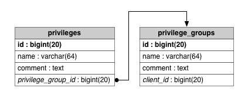
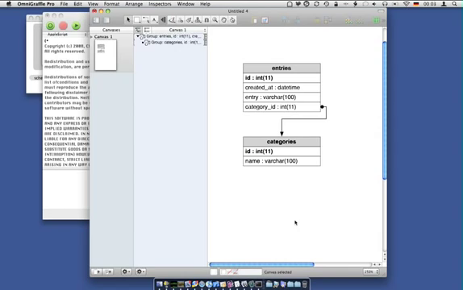

Introduction
============

This AppleScript creates a database schema from [mysql](http://www.mysql.com) tables in OmniGraffle. It requires the mysql command line tool and a version of [OmniGraffle](http://www.omnigroup.com/omnigraffle/) to be installed on your computer.

The following YouTube video shows the AppleScript in action creating a new document from a mysql database:

http://www.youtube.com/watch?feature=player_embedded&v=6rp26-ds1dY
